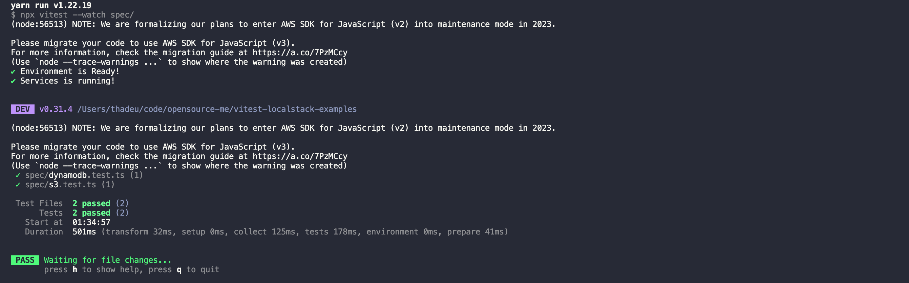

# vitest-localstack-example

Clone repository, install dependencies and run `yarn test:run`

## What this will be do?

- Run AWS Services locally in your Docker
- Configure Vitest
- Run your tests

